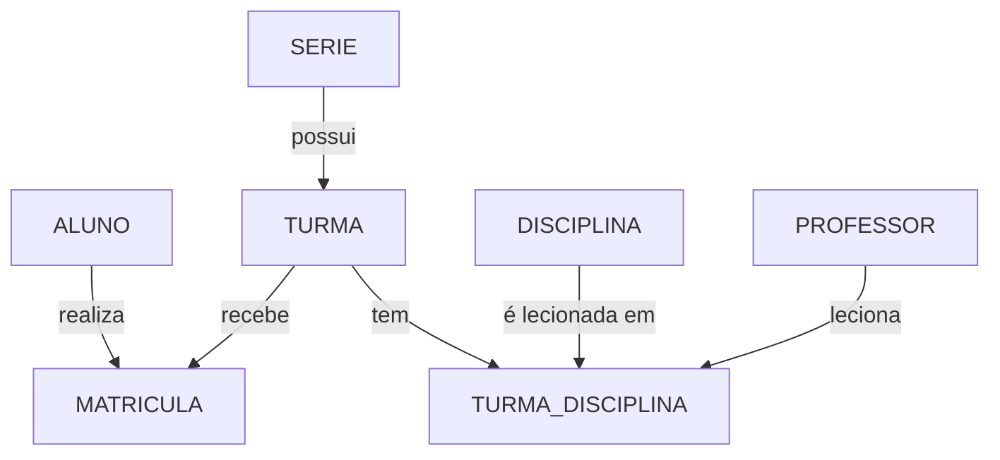

# Escola-sql

Banco de dados de uma escola com séries, turmas, alunos, professores, disciplinas e matrículas

## Objetivo

Esse projeto simula o sistema de controle acadêmico de uma escola, incluindo séries, turmas, alunos, professores, disciplinas, matrículas e a grade de aulas (quem leciona o quê, para qual turma).

O banco foi modelado em SQL (MySQL 8.0+), com chaves primárias, estrangeiras e restrições de integridade para garantir a consistência dos dados.

## Estrutura

* `01_ddl_escola.sql` → criação do banco `escola` e de todas as tabelas

### Tabelas

| Tabela | Descrição |
|---|---|
| `serie` | Nível pedagógico (6º Ano, 7º Ano, 1ª Série EM...) |
| `turma` | Turma de um ano letivo (ex.: 6º Ano A, manhã, 2026) |
| `aluno` | Nome, data de nascimento, CPF e e-mail |
| `disciplina` | Catálogo de disciplinas |
| `professor` | Nome, formação e e-mail |
| `matricula` | Liga aluno a turma em um ano letivo |
| `turma_disciplina` | Grade de aulas: professor + disciplina + turma |

## Relacionamentos

* Uma série possui várias turmas; cada turma pertence a uma única série
* Alunos são vinculados a turmas por meio de matrículas (um aluno só pode estar em uma turma por ano letivo)
* A grade de aulas liga turmas, disciplinas e professores (cada disciplina tem um único professor por turma)
* Professores que ainda lecionam não podem ser excluídos

